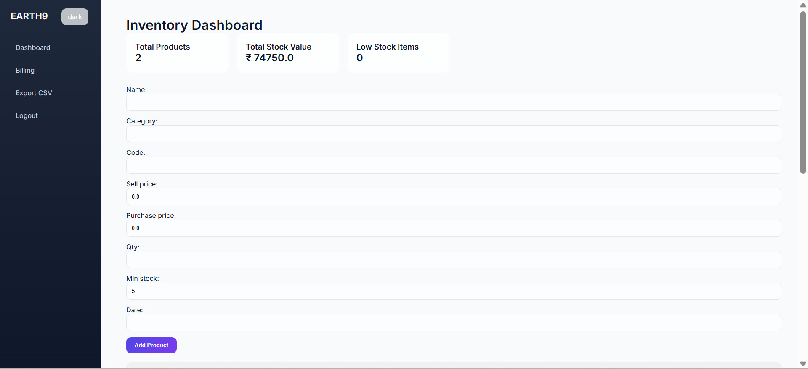
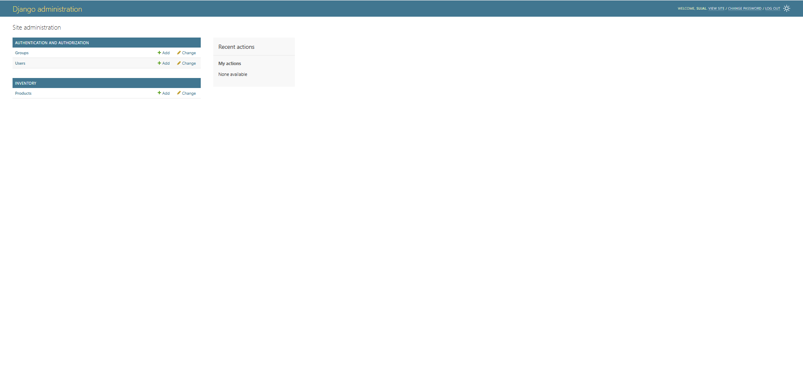
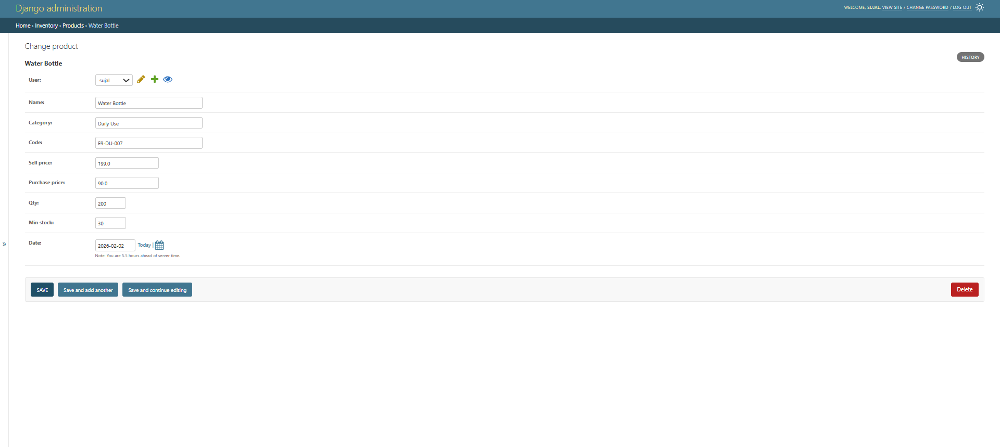

# Earth9 Inventory

Earth9 Inventory is a **web-based inventory management system** built with Django.  
It allows users to manage products, stock levels, and billing efficiently via a **dashboard** and **Django admin panel**.

---

## Features

- User authentication (login/logout)
- Dashboard with inventory statistics:
  - Total products
  - Total stock value
  - Low stock items
  
- Add, edit, and delete products
- Billing system for customers
- Export inventory data as CSV
- Interactive charts for product stock
- Dark mode toggle
- Manage all products, bills, and users via **Django admin panel**

---

## Tech Stack

- **Backend:** Python, Django  
- **Frontend:** HTML, CSS, JavaScript  
- **Database:** Default Django database  
- **Admin Panel:** Django Admin  
- **Charts:** Chart.js  

---
## Screenshots

## Login page


## Dashboard page



## Bill page


## Admin panel of Django




## Installation

1. **Clone the repository:**
```bash
git clone https://github.com/sujalsolanki1718/earth9-inventory.git
cd earth9-inventory/earth9backend
